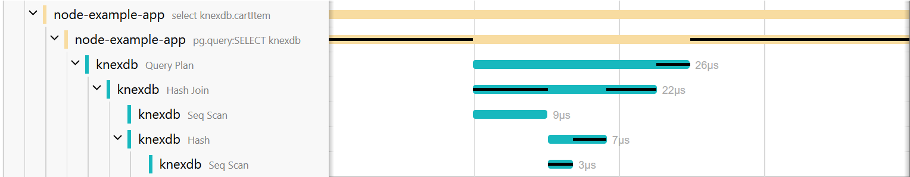

# pg trace connector
The pg trace connector is a connector for the OpenTelemetry Collector that transforms logs containing traceparent information and a query plan into traces. Each plan step of the query plan will result in an individual span.



The connector requires logs with the correct timestamp and the message attribute containing the duration and query plan, generated with the `auto_explain` PostgreSQL module. An example message is shown at the bottom.

## Building and Running this Component Locally
The pg trace connector must be built into a distribution of an OpenTelemetry Collector.
This requires the OpenTelemetry Collector Builder (ocb). How to install and use the ocb is documented here:
https://opentelemetry.io/docs/collector/building/connector/#using-the-component

This repository contains a manifest for building a collector with the connector in `builder-config.yaml`.

To build this component run:
```sh
ocb --config builder-config.yaml
```

To run this component run:
```sh
otelcol-dev/otelcol-dev-bin --config otelcol-config.yaml
```

Configure the OTLP receiver and exporter to ingest logs and export traces in `otelcol-config.yaml`

## Building and Running this Component using Containers

To build this component into a container run:

```sh
build -t pgtraceconnector .
```

Then run it and mount your `otelcol-config.yaml` using:

```sh
docker run -p 4317:4317 -v ./otelcol-config.yaml:/etc/otelcol-contrib/config.yaml pgtraceconnector
```

## Example of the expected message attribute
```json
duration: 0.071 ms  plan:
{
  "Query Text": "select \"cartItem\".\"id\", \"cartItem\".\"product_id\", \"cartItem\".\"quantity\", \"product\".\"name\", \"product\".\"price\" from \"cartItem\" inner join \"product\" on \"cartItem\".\"product_id\" = \"product\".\"id\" where \"user_id\" = $1 /*traceparent='00-7c9586f186392ba651be1d56d00a220f-61df26b6554797ba-01'*/",
  "Query Parameters": "$1 = '3'",
  "Plan": {
    "Node Type": "Hash Join",
    "Parallel Aware": false,
    "Async Capable": false,
    "Join Type": "Inner",
    "Startup Cost": 11.12,
    "Total Cost": 38.14,
    "Plan Rows": 7,
    "Plan Width": 542,
    "Actual Startup Time": 0.022,
    "Actual Total Time": 0.025,
    "Actual Rows": 1,
    "Actual Loops": 1,
    "Inner Unique": true,
    "Hash Cond": "(\"cartItem\".product_id = product.id)",
    "Plans": [
      {
        "Node Type": "Seq Scan",
        "Parent Relationship": "Outer",
        "Parallel Aware": false,
        "Async Capable": false,
        "Relation Name": "cartItem",
        "Alias": "cartItem",
        "Startup Cost": 0.00,
        "Total Cost": 27.00,
        "Plan Rows": 7,
        "Plan Width": 12,
        "Actual Startup Time": 0.011,
        "Actual Total Time": 0.012,
        "Actual Rows": 1,
        "Actual Loops": 1,
        "Filter": "(user_id = 3)",
        "Rows Removed by Filter": 1
      },
      {
        "Node Type": "Hash",
        "Parent Relationship": "Inner",
        "Parallel Aware": false,
        "Async Capable": false,
        "Startup Cost": 10.50,
        "Total Cost": 10.50,
        "Plan Rows": 50,
        "Plan Width": 534,
        "Actual Startup Time": 0.007,
        "Actual Total Time": 0.008,
        "Actual Rows": 4,
        "Actual Loops": 1,
        "Hash Buckets": 1024,
        "Original Hash Buckets": 1024,
        "Hash Batches": 1,
        "Original Hash Batches": 1,
        "Peak Memory Usage": 9,
        "Plans": [
          {
            "Node Type": "Seq Scan",
            "Parent Relationship": "Outer",
            "Parallel Aware": false,
            "Async Capable": false,
            "Relation Name": "product",
            "Alias": "product",
            "Startup Cost": 0.00,
            "Total Cost": 10.50,
            "Plan Rows": 50,
            "Plan Width": 534,
            "Actual Startup Time": 0.003,
            "Actual Total Time": 0.004,
            "Actual Rows": 4,
            "Actual Loops": 1
          }
        ]
      }
    ]
  }
}
```